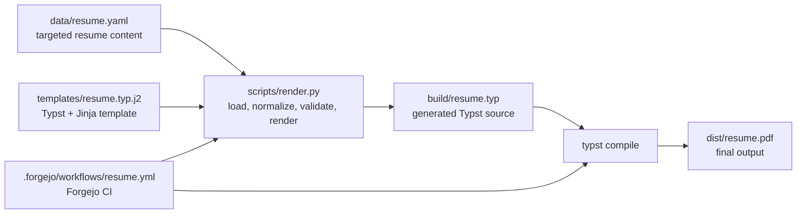

# Resume

Resume as code, built from structured YAML data and rendered to PDF with Python, Typst, and Jinja.

## Overview

This repository treats a resume like a build artifact.

The current setup is focused on a targeted resume pipeline:

- `data/resume.yaml` stores the targeted resume content
- `scripts/render.py` loads, normalizes, and validates the YAML
- `templates/resume.typ.j2` renders the targeted Typst layout
- `build/resume.typ` is the generated intermediate file
- `typst compile` produces the final PDF in `dist/resume.pdf`

This gives you:

- a single structured source of truth
- reproducible PDF output
- versioned resume changes in Git
- CI-based builds in Forgejo Actions
- support for multi-role employers without awkward document editing

## Build flow



## Repository layout

```text
.
├── .forgejo/workflows/resume.yml   # CI pipeline
├── data/resume.yaml                # targeted resume source data
├── scripts/render.py               # YAML -> Typst renderer
├── templates/resume.typ.j2         # targeted Typst + Jinja template
├── requirements.txt                # Python dependencies
├── build/                          # generated Typst output
└── dist/                           # compiled PDF output
```

## Source of truth

All resume content is defined in:

```text
data/resume.yaml
```

The current renderer and template are built around a targeted schema.
The previous flat `experience[*].role` approach has been replaced with a nested employer -> roles structure so a single employer can contain multiple role line items.

Recommended top-level keys:

```yaml
schema_version: 2

document:
basics:
summary:
experience:
education:
training:
certifications:
```

## Current targeted schema

```yaml
schema_version: 2

document:
  type: targeted
  role_target: Example Role
  show_summary: true
  show_skills: false
  show_projects: false
  show_training: true
  show_certifications: true

basics:
  name:
  headline:
  location:
  phone:
  emails:
  links:

summary:

experience:
  - company:
    location:
    start:
    end:
    roles:
      - title:
        start:
        end:
        summary:
        bullets:

education:
  - degree:
    school:
    year:

training:
  - name:
    provider:
    completed:

certifications:
  - name:
    issuer:
    issued:
    expires:
    credential_id:
```

## Schema notes

### `document`

The `document` object controls targeted-template behavior.

Supported flags:

- `show_summary`
- `show_skills`
- `show_projects`
- `show_training`
- `show_certifications`

For the current targeted template, `show_skills` and `show_projects` are usually `false`.

### `basics`

Use list fields for contact data that can appear more than once:

```yaml
basics:
  name: Jane Example
  headline: Program Manager
  location: Denver, CO
  phone: 555-0100
  emails:
    - jane@example.com
    - jane.work@example.org
  links:
    - label: Portfolio
      url: https://example.com
    - label: LinkedIn
      url: https://linkedin.com/in/example
```

The targeted template renders:

- phone
- one or more email addresses
- location
- one or more labeled links

### `experience`

The preferred shape is a list of employers, each with one or more nested roles.

Example:

```yaml
experience:
  - company: Example Museum
    location: Denver, CO
    start: 2018
    end: Present
    roles:
      - title: Programs Manager
        bullets:
          - Led seasonal programming and event planning.
      - title: Visitor Services Coordinator
        start: 2015
        end: 2018
        bullets:
          - Coordinated volunteers and front-desk operations.
```

This structure is useful when:

- one employer includes multiple titles
- you want role progression shown clearly
- you want one employer heading with multiple line items underneath it

### Optional sections

The current targeted template renders these sections when enabled and populated:

- Summary
- Experience
- Education
- Training
- Certifications

Skills, projects, selected highlights, awards, publications, and volunteering are not part of the current targeted layout.

## Renderer behavior

`scripts/render.py` does the following:

- loads `data/resume.yaml`
- normalizes known sections to safe defaults
- validates required structure
- supports `basics.emails` and `basics.links`
- supports nested `experience[*].roles[*]`
- tolerates the older flat `experience[*].role` format as a fallback
- normalizes `certifications[].date` to `issued` when needed
- normalizes `training[].year` to `completed` when needed
- writes the rendered Typst file to `build/resume.typ`

### Validation philosophy

The renderer is intentionally lenient:

- missing optional sections become empty defaults
- missing optional subfields are omitted in output
- clearly invalid known structures still fail fast with useful errors

Examples of invalid input that should fail:

- `basics` is not an object
- `experience` is not a list
- `experience` is empty
- an `experience` item is missing `company`
- an employer has neither `roles` nor a fallback flat `role`

## Typst template

The template lives at:

```text
templates/resume.typ.j2
```

The targeted template currently handles:

- header with multiple emails and labeled links
- summary
- employer blocks with nested role line items
- education
- training
- certifications

## Local build

### Requirements

You need:

- Python 3
- `pip`
- Typst
- the Python packages from `requirements.txt`

### Install dependencies

```bash
python3 -m venv .venv
. .venv/bin/activate
python -m pip install --upgrade pip
python -m pip install -r requirements.txt
```

### Render the Typst source

```bash
python scripts/render.py
```

### Compile the PDF

```bash
mkdir -p dist
typst compile build/resume.typ dist/resume.pdf
```

## CI build with Forgejo Actions

The workflow is defined in:

```text
.forgejo/workflows/resume.yml
```

It runs on:

- pushes to `master`
- manual `workflow_dispatch`

The workflow:

1. checks out the repository
2. installs system packages and fonts
3. creates a Python virtual environment
4. installs Python dependencies
5. downloads and installs Typst
6. renders `build/resume.typ`
7. compiles `dist/resume.pdf`
8. uploads the PDF as a build artifact

## Output files

Generated files are intentionally separated from source files:

- `build/resume.typ` -> intermediate generated Typst source
- `dist/resume.pdf` -> final compiled resume PDF

These directories are ignored by Git.

## Quick edit workflow

When making changes:

1. edit `data/resume.yaml`
2. run `python scripts/render.py`
3. run `typst compile build/resume.typ dist/resume.pdf`
4. review the PDF
5. commit and push

## Troubleshooting

### Common formatting issues

If the rendered PDF looks wrong, check these first:

- a text value may contain Typst-sensitive characters
- a YAML field may have the wrong type
- indentation in YAML may be off
- a long unbroken string may push the layout in unexpected ways
- Markdown-style assumptions do not always map cleanly to Typst layout

### Typst-sensitive characters

The renderer escapes common Typst-sensitive characters in normal text output, including:

- backslash: `\\`
- dollar sign: `$`
- hash: `#`
- left bracket: `[` 
- right bracket: `]`
- at sign: `@`

This helps with normal text fields, but URLs and structurally meaningful Typst syntax should still be treated carefully.

### Sharing or pasting files in ChatGPT

When sharing this repo or asking ChatGPT to rewrite files, formatting can break in chat if the response is not fenced cleanly.

Recommended practice:

- ask for one file per code block when reviewing changes
- use fenced code blocks for all YAML, Python, and Typst output
- keep indentation exactly as shown
- do not trust wrapped lines in chat unless they are inside a code block

If a file itself needs triple backticks inside it, use a longer outer fence. For example, use four backticks for the outer fence instead of three.

Example:

````markdown
```text
literal content that contains markdown-like characters
```
````

If Typst or YAML looks malformed after pasting from chat, compare it against the repository version rather than the visual chat rendering.

## Why this approach

This setup makes the resume:

- easy to diff and review
- easy to automate
- easy to reproduce
- easy to extend
- easier to maintain as structured data instead of manual document editing
